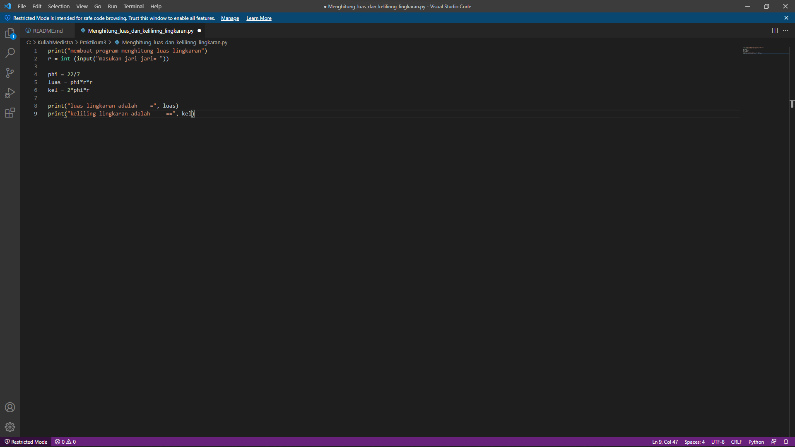
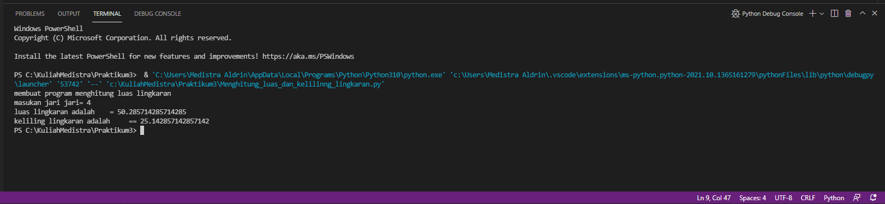
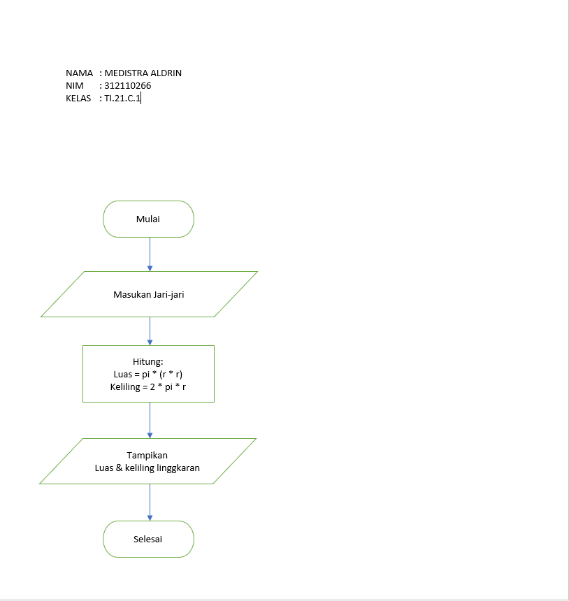

# Praktikum3
## Tutorial menghitung luas dan keliling lingkaran menggunakan python oleh Meedistra Aldrin

 Pertama buka aplikasi terlebih dahulu, save file menggunakan format python. Kemudian masukan program untuk menghitung luas dan keliling lingkaran seperti pada gambar berikut ini: 

 Kemudian jalankan program dengan menggunakan opsi "run". Setelah muncul hasil program masukan Jari-jari yang di inginkan, maka program akan menghitungnya secara otomatis seperti pada gambar berikut: 

## Contoh flowchart menghitung luas dan keliling lingkaran

